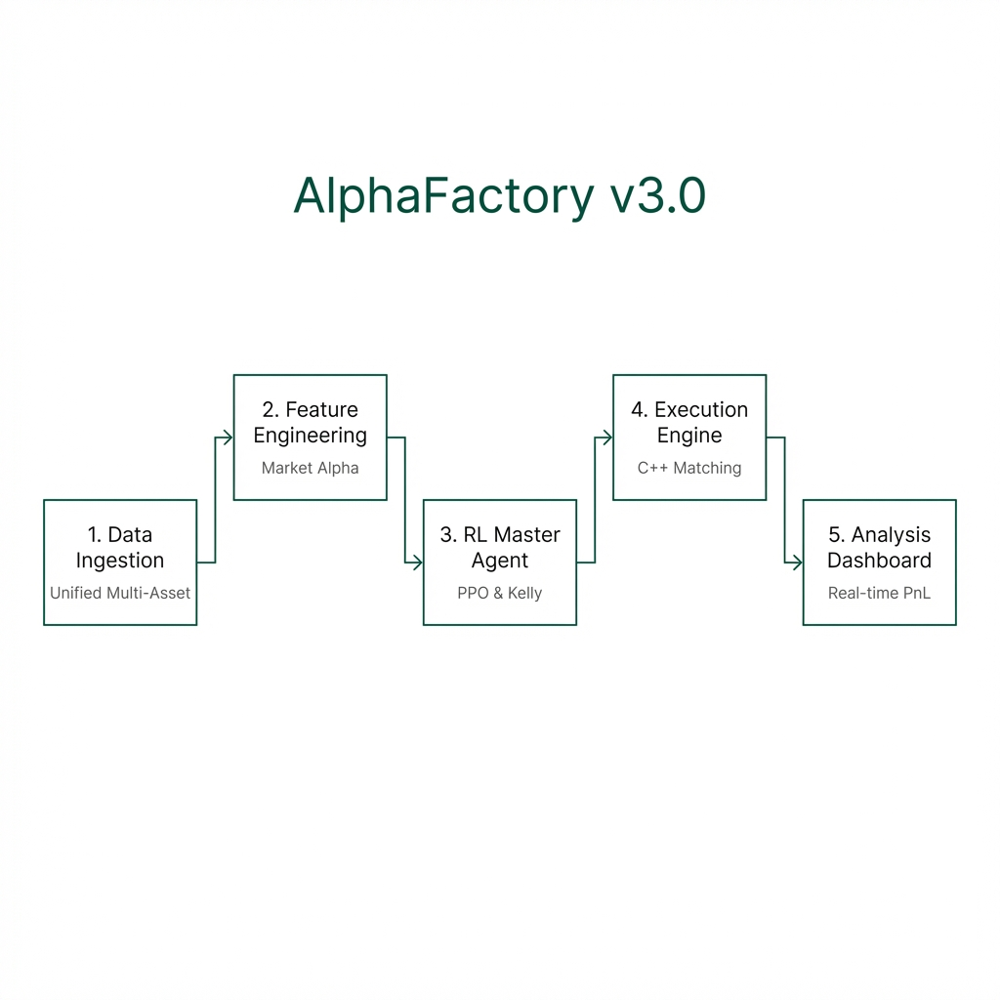

# AlphaFactory v2.1
**Multi-Asset ML Alpha Factory with C++ Execution Engine**



## Overview

AlphaFactory is a systematic trading stack that bridges the gap between research and execution. It combines high-level Python ML research with a low-level C++ simulation engine.

**Key Capabilities:**
- **Multi-Asset**: Seamlessly handles Equities, Crypto, and FX.
- **Advanced ML**: XGBoost gradient boosting for robust signal generation.
- **Realistic Simulation**: C++ execution engine with Limit Order Book (LOB) matching and risk checks.

## What's New in v2.1

**Simplified Architecture**: Removed Transformer and Ensemble models to focus on a streamlined, production-ready XGBoost pipeline.

**Key Changes**:
- ✅ **XGBoost-Only**: Single, fast gradient boosting model (removed PyTorch dependency)
- ⚡ **Memory Optimized**: Efficient sliding window implementation using NumPy stride tricks
- 🧹 **Cleaner Codebase**: Removed `model_transformer.py`, `model_lstm.py`, `model_tcn.py`, `ensemble.py`
- 📊 **Same Features**: Full technical indicators (RSI, MACD, Bollinger, ATR, Skew, Kurtosis)
- 🚀 **Faster Training**: ~50% reduction in training time

**Previous Features (v2.0)**:
- Multi-Asset Support for Equities, Crypto, and FX
- Advanced feature engineering pipeline
- C++ execution engine with realistic order matching

---

## Project Structure

```
AlphaFactory/
├── data/                   # OHLCV data storage
│   ├── equities/
│   ├── crypto/
│   └── fx/
├── research/               # Python Research Pipeline
│   ├── feature_engineering.py  # Technical & Statistical features
│   ├── model_xgb.py            # XGBoost model wrapper
│   ├── evaluation.py           # Performance metrics (Sharpe, Sortino, etc.)
│   ├── walk_forward.py         # Walk-forward validation utilities
│   └── common.py               # Data loaders & utilities
├── signals/                # Generated signals
├── execution_engine/       # C++ LOB & Simulator
├── backtester/             # Python-based PnL analysis
├── notebooks/              # Jupyter notebooks for analysis
├── run_strategy.py         # Main orchestration script
└── dashboard_app.py        # Streamlit UI
```

## Python Research Pipeline

**Philosophy**: Simple, fast, and memory-efficient. The pipeline uses XGBoost exclusively, chosen for its:
- **Speed**: Trains in seconds on multi-asset datasets
- **Robustness**: Handles missing data and outliers gracefully
- **Interpretability**: Feature importance analysis built-in
- **Memory Efficiency**: Optimized sliding window implementation prevents crashes on large datasets

1.  **Data Loading**: 
    -   `data.download_data` fetches daily OHLCV from Yahoo Finance.
    -   Supports auto-normalization of diverse assets.

2.  **Feature Engineering**:
    -   **Microstructure**: High/Low spread, Close position in bar.
    -   **Technical**: RSI (14), MACD, Bollinger Bands, ATR.
    -   **Statistical**: Rolling Skewness and Kurtosis (20-day) to capture tail risk.
    -   **Tensorization**: Converts data into `[Samples, Lookback, Features]` 3D tensors.

3.  **Model Training**:
    -   **XGBoost**: Gradient boosting with 100 estimators, max depth 6, learning rate 0.1
    -   **Training**: 80/20 train/validation split with early stopping
    -   **Memory Management**: Explicit garbage collection after processing each asset

4.  **Signal Export**:
    -   Predictions are finalized and exported to CSV for the Execution Engine.

### Quick Start
Run the full pipeline with one command:
```bash
python run_strategy.py
```

---

## C++ Execution Engine

The execution engine is designed to verify that signals can be traded in a realistic environment.

**Components:**
- **Order Book**: Limit Order Book with FIFO queues.
- **Matching Engine**: Supports Limit and Market orders, partial fills.
- **Risk Checks**: Max position size, Max notional exposure.
- **Simulator**: Replays historical orders against the matching engine.

### Build & Run
```bash
mkdir build
cd build
cmake ..
cmake --build .

# Run simulator with generated orders
./alpha_engine_sim ../signals/signal_files/orders.csv
```

---

## Streamlit Dashboard

Visualize your alpha signals and backtest performance.

```bash
streamlit run dashboard_app.py
```
It displays:
-   Signal Heatmaps across assets.
-   Cumulative PnL equity curves.
-   Feature correlations.

---

## Data Download Helper

Populate your data directories easily:

```bash
# Equities
python -m data.download_data --asset-class equities --symbol AAPL --start 2020-01-01

# Crypto
python -m data.download_data --asset-class crypto --symbol BTC-USD --start 2022-01-01

# FX
python -m data.download_data --asset-class fx --symbol EURUSD --start 2020-01-01
```

---

## Example End-to-End Flow

1.  **Download**: Fetch `AAPL` and `BTC-USD`.
2.  **Run Strategy**: `python run_strategy.py` matches timestamps, generates features, trains XGBoost, and saves `ensemble_signals.csv`.
3.  **Simulation**: (Optional) Convert signals for C++ engine and valid execution logic.
4.  **Analysis**: Open the Dashboard to view the resulting Alpha.
